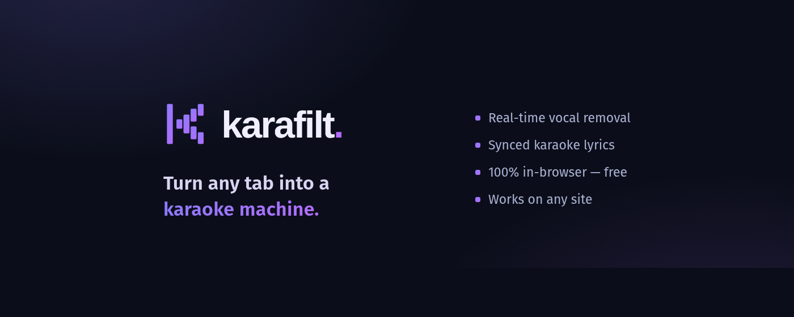
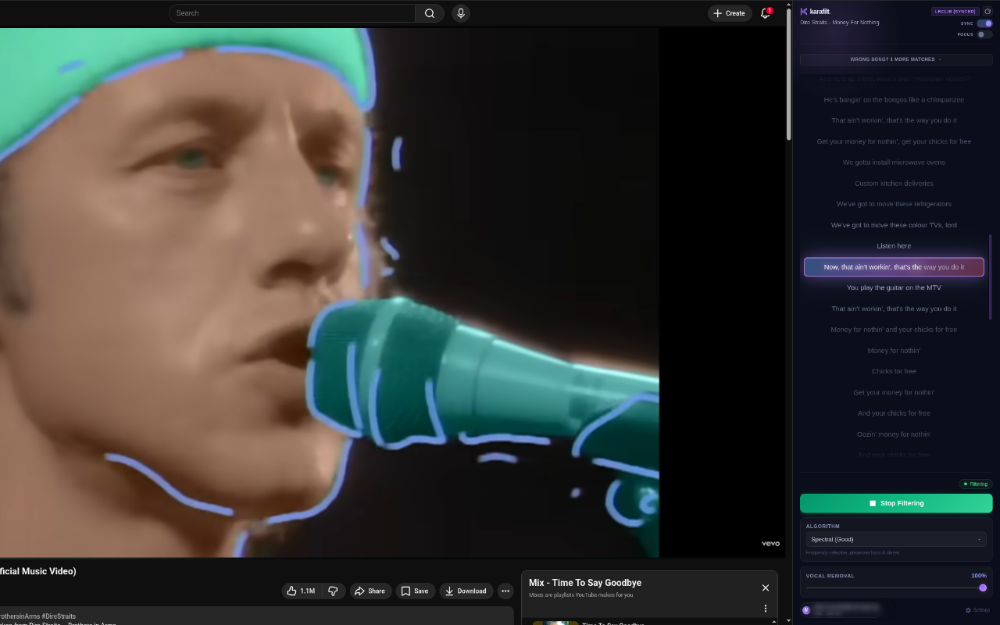
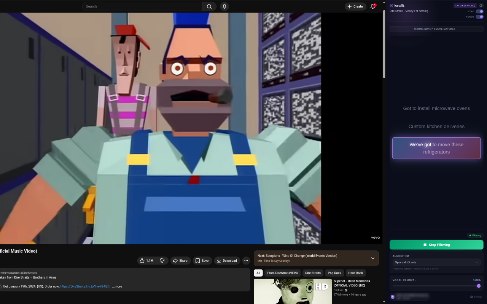
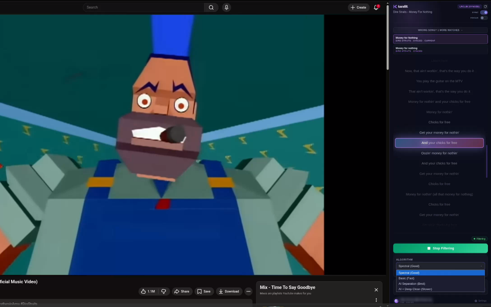
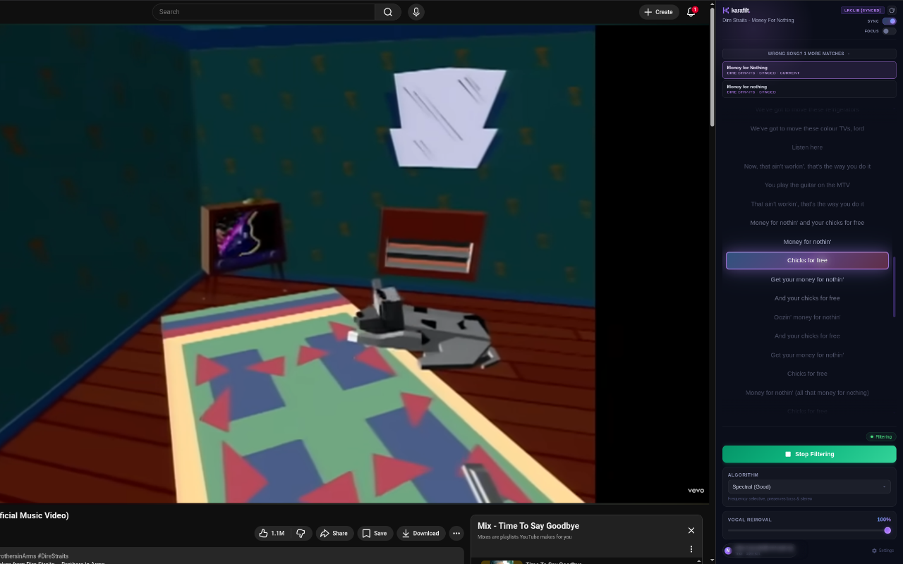
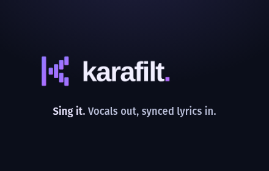

<p align="center">
  
</p>

# Karafilt

<p align="center">
  
</p>

<p align="center">
  <strong>🌐 <a href="https://karafilt.com">karafilt.com</a></strong>
</p>

**Real-time vocal removal for any browser tab.** Turn any song playing in Chrome into a karaoke track — no downloads, no uploads, just sign in and sing. Free.

<p align="center">
  
</p>

## How It Works

Karafilt captures audio from your active browser tab and removes the vocals in real time, entirely in your browser. It works with YouTube, Spotify Web Player, SoundCloud, or any website that plays audio. The audio never leaves your machine.

<p align="center">
  
</p>

### Processing Modes

| Mode | Quality | Latency |
|------|---------|---------|
| **Spectral (Good)** | Medium | Real-time |
| **Spectral Deep (Strong)** | Higher (strips center backing vocals) | Real-time |
| **Basic (Fast)** | Lower | Real-time |

All three modes run entirely in your browser using WebAssembly — no server, no uploads.

<p align="center">
  
</p>

When a track has multiple matches (covers, live versions, remixes), pick the right one from the alternatives picker:

<p align="center">
  
</p>

## Installation

### From Chrome Web Store

**[Install Karafilt from the Chrome Web Store →](https://chromewebstore.google.com/detail/eiclobknpdiipnhdpfpegfnkplmfnmoo)**

Karafilt is free — just create an account at **[karafilt.com](https://karafilt.com)** and sign in from the extension.

### Manual Install (Developer Mode)

1. Download or clone this repository
2. Open `chrome://extensions/` in Chrome
3. Enable **Developer mode** (top-right toggle)
4. Click **Load unpacked** and select this folder
5. The Karafilt icon appears in your toolbar

## Usage

1. Click the Karafilt extension icon to open the side panel
2. Sign in with your free Karafilt account
3. Play a song in any tab (YouTube, Spotify, etc.)
4. Choose a processing mode
5. Adjust the **Vocal Removal** slider (0-100%)
6. Click **Start Filtering**

Your settings (mode, slider position) are saved automatically and persist across sessions.

---

## For Developers

### Repository layout

Karafilt spans **two repositories**:

- **`karaoke-filter-plugin`** (this repo) — the Chrome extension (all in-browser; no
  backend server).
- **`website`** — the Next.js web app + API: free accounts, email verification,
  reviews, donations, and self-serve account deletion.

The extension uses the website only to confirm the user is signed in (a cookie-based
`/api/me` probe) — there is no audio backend; all processing runs locally in the
extension.

### Architecture

```
Browser Extension (Chrome Manifest V3)
  ├── sidepanel/      — main UI (lyrics, mode, mix slider, sign-in gate)
  ├── service-worker  — orchestrates capture lifecycle + lyrics lookups
  ├── offscreen.js    — audio capture (Web Audio API)
  ├── worklet-processor.js — real-time WASM processing on the audio thread
  └── wasm/           — C source & compiled WebAssembly (STFT, center-cancel)
```

Audio is captured from the active tab and processed in real time by the WASM
AudioWorklet — spectral / center-channel vocal cancellation, never uploaded.

### Building the WASM Module

Requires [Emscripten](https://emscripten.org/docs/getting_started/downloads.html):

```bash
make phase2   # builds wasm/build/vocal_remove.wasm
```

## License

The Karafilt browser extension is open source under the **MIT License** — see
[`LICENSE`](LICENSE).

Third-party dependencies (Next.js, etc.) remain under their own licenses.

Copyright © 2026 Betania.io.

See also [`CONTRIBUTING.md`](CONTRIBUTING.md) and
[`CODE_OF_CONDUCT.md`](CODE_OF_CONDUCT.md).

---

<p align="center">
  <a href="https://karafilt.com"></a>
  <br>
  <strong>🌐 <a href="https://karafilt.com">karafilt.com</a></strong>
</p>
